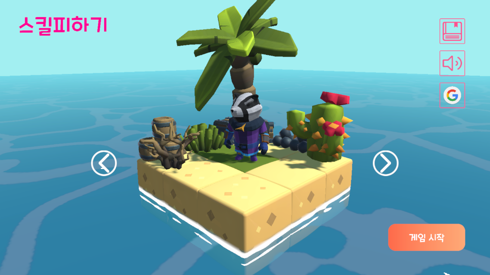
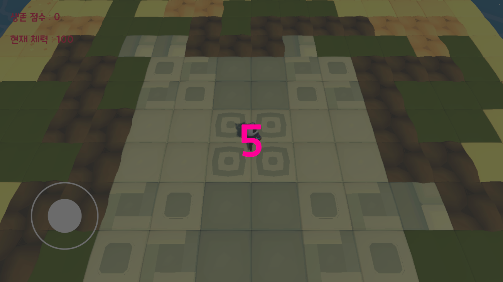
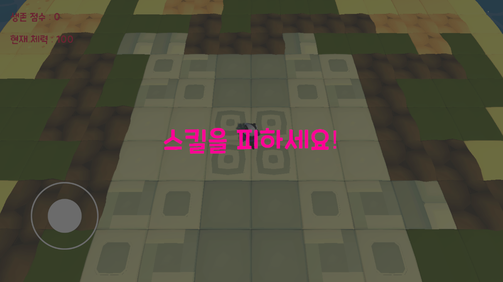
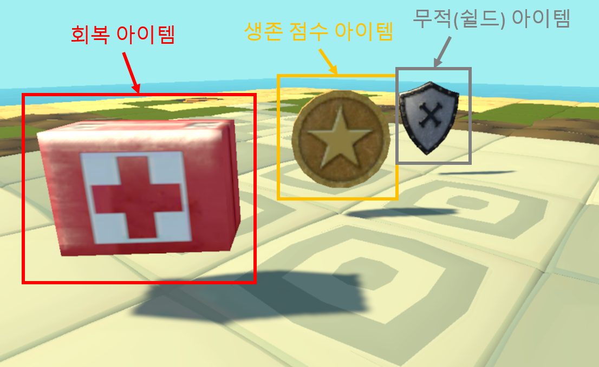
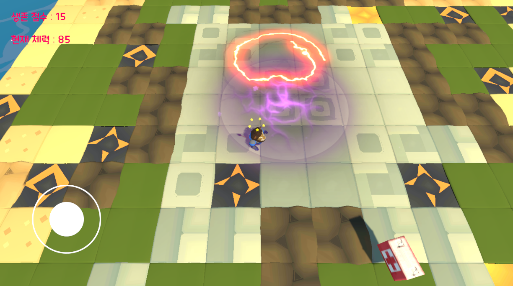
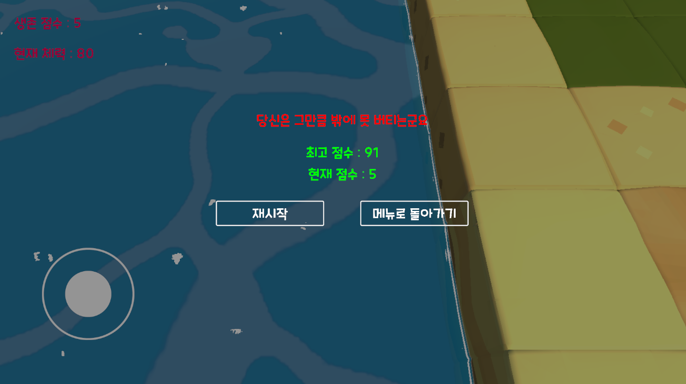
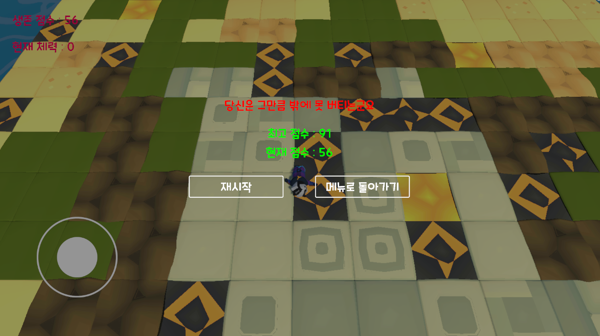

# 스킬피하기 (AvoidSkills)

* 이 게임은 '닷지' 게임을 모티브로한 게임 입니다. 랜덤한 시간과 위치에 생성되는 스킬공격들을 피하며, 랜덤한 시간과 위치에 생성되는 아이템들을 이용하여 생존 점수를 올리는 게임입니다.

# 프로젝트 종류
* 1인 프로젝트

# 개요
* 게임 명 : 스킬피하기
* 개발 툴 : Unity, Rider
* 개발 언어 : C#
* 플랫폼 : Android

# 제작 기간
* 2020.11 ~ 2021.02
* 2021.02 (출시)

# 맡은 역할
* 그래픽 리소스 제작을 제외한 모든 것

# 상세 내용
* 로비 화면에서 "게임 시작" 버튼을 누르면 필드에 진입합니다.
* 필드에 진입하면 준비를 위해 모든 조작을 막고 카운트를 진행합니다.

* 플레이어를 기준으로 일정 거리 내에 가상의 구(Sphere)를 그리고 구(Sphere) 내에 랜덤한 위치와 시간에 스킬과 아이템이 생성되며, 일정 시간 이후 사라집니다.
* 스킬은 플레이어에게 데미지를 입힐 수 있으며, 오브젝트 풀링을 통해 생성됩니다.
* 아이템은 현재까지는 세 종류("체력 회복", "생존 점수 상승", "보호막")입니다. 모든 아이템은 스킬과 마찬가지로 오브젝트 풀링을 통해서 생성됩니다.

* "보호막" 아이템의 경우 일정 시간동안 플레이어는 어떠한 공격도 받을 수 없는 상태를 만들어줍니다.
* 플레이어가 위치하는 맵(필드)는 지정된 시간이 지나면 플레이어에게 데미지를 입히는 땅으로 변합니다. 플레이어는 이 위에 있을 경우 지정된 시간까지 1초마다 데미지를 입습니다.

* 맵을 변하게 하는 기능은 오브젝트 풀링을 통해서 구현했습니다.
* 플레이어는 지정된 맵(필드) 외에는 플레이어가 바로 사망하는 지역으로 지정했습니다.
* 플레이어가 사망하게 되면 이번 게임에서의 점수를 출력하고, 저장된 최고 점수를 출력합니다.

